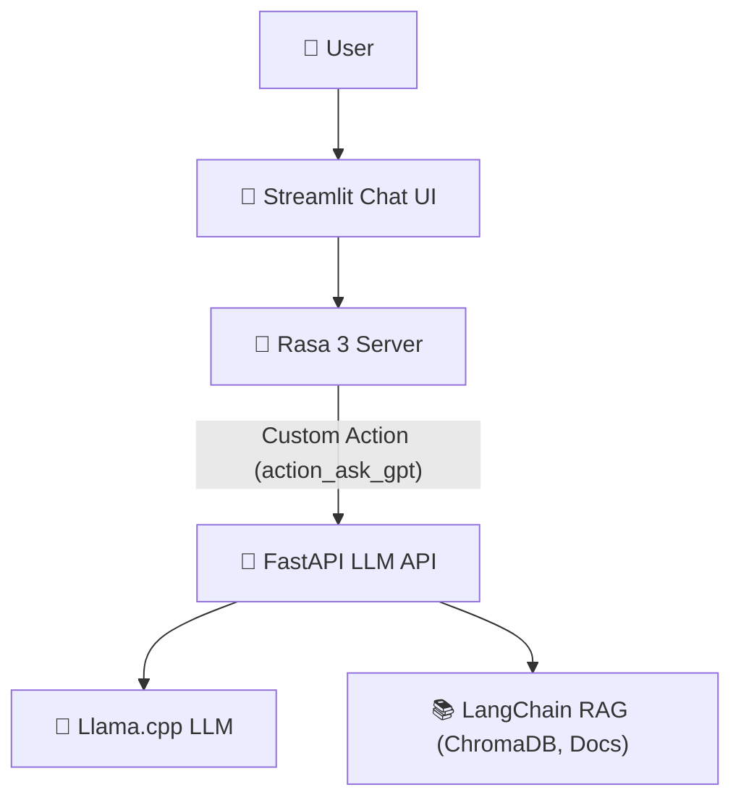

# Automated Customer Support Chatbot

<p align="center">
  
  
  
  
  
  
</p>

A next-generation hybrid customer support chatbot combining the power of **Rasa 3**, **LangChain**, **Llama.cpp**, and **FastAPI**, with a sleek **Streamlit** chat UI. Deliver both structured and generative answers—leveraging local LLMs and Retrieval Augmented Generation (RAG)—for exceptional customer experiences.

---

## 🚀 Features

- 🧠 **Hybrid Intelligence**: Rasa's robust dialogue + LLM-powered generative answers
- 🦙 **Local LLaMA Backend**: Fast, private, and cost-effective (supports `unsloth.Q8_0.gguf` and more)
- 📚 **RAG Support**: LangChain + ChromaDB for document-grounded answers
- ⚡ **FastAPI Microservice**: Scalable LLM API for custom actions
- 💬 **Modern Streamlit UI**: Chat-style, responsive, and cloud-ready
- ☁️ **Flexible Deployment**: Run locally, on your server, or deploy the UI to Streamlit Cloud

---

## 🏗️ Architecture



---

## 📂 Project Structure

```text
Automated-Customer-Support-Chatbot/
├─ actions/           # Custom Rasa actions (calls LLM API)
├─ data/              # Rasa NLU, stories, rules
├─ models/            # Trained Rasa models, LLaMA GGUF files
├─ results/           # Output, logs, etc.
├─ app.py             # Streamlit frontend
├─ llm_api.py         # FastAPI LLM+RAG backend
├─ start_chatbot.py   # Script to launch all services locally
├─ requirements.txt   # Python dependencies
├─ README.md          # This file
└─ ...                # Other configs and scripts
```

---

## 🌐 How It Works

1. 👤 **User** chats via the Streamlit web UI
2. 💬 **Streamlit** sends messages to the **Rasa 3 server** (REST API)
3. 🤖 **Rasa** handles intent/entity recognition and dialogue
4. 🚀 For open-ended/knowledge queries, Rasa triggers `action_ask_gpt`:
    - Calls the **FastAPI LLM API**
    - API uses **LangChain** to retrieve context (RAG) and generate a response with **Llama.cpp**
5. 🔁 The answer flows back to the user via Rasa and Streamlit

---

## 🛠️ Tech Stack

| Backend         | LLM & RAG         | Frontend      | Deployment         |
|-----------------|-------------------|---------------|--------------------|
| Rasa 3          | Llama.cpp         | Streamlit     | Local/Cloud        |
| FastAPI         | LangChain         |               | Streamlit Cloud ☁️ |
| Python 3.8–3.10 | ChromaDB          |               | Docker (optional)  |

---

## ⚡ Quickstart

### 1. Clone the Repository
```sh
git clone https://github.com/your-username/Automated-Customer-Support-Chatbot.git
cd Automated-Customer-Support-Chatbot
```

### 2. Install Dependencies
```sh
pip install -r requirements.txt
```

### 3. Set Up Environment Variables
Create a `.env` file:
```env
OPENAI_API_KEY=your_openai_key
GGUF_MODEL_PATH=path_to_your_llama_model.gguf
```

### 4. Train and Start Rasa
```sh
rasa train
rasa run --enable-api
```

### 5. Start the LLM API
```sh
python llm_api.py
```

### 6. Start the Streamlit Frontend
```sh
streamlit run app.py
```

Or use `start_chatbot.py` to launch all services together (locally).

---

## ☁️ Deploying on Streamlit Cloud

- Only the Streamlit frontend is deployed on Streamlit Cloud.
- Rasa and the LLM API must run on a separate server (local, VM, or cloud).
- Set the Rasa server URL in your Streamlit Cloud environment variables.

---

## 📝 Customization

- 📄 **Add Documents**: Place PDFs, Markdown, or text files in the `docs/` folder for RAG.
- 🗣️ **NLU & Stories**: Edit `data/nlu.yml`, `data/stories.yml`, and `data/rules.yml` for intents and flows.
- 🛠️ **Custom Actions**: Extend logic in `actions/`.
- ⚙️ **Model**: Swap out LLaMA models by changing `GGUF_MODEL_PATH`.

---

## 🛟 Troubleshooting

- See [TROUBLESHOOTING.md](./TROUBLESHOOTING.md) for common issues and solutions.
- Key tips:
  - Ensure Rasa and LLM API are running and accessible
  - Check environment variables and API keys
  - Review logs for errors

---

## 📄 License

MIT License

---

> Made with ❤️ by Faisal Hakimi
